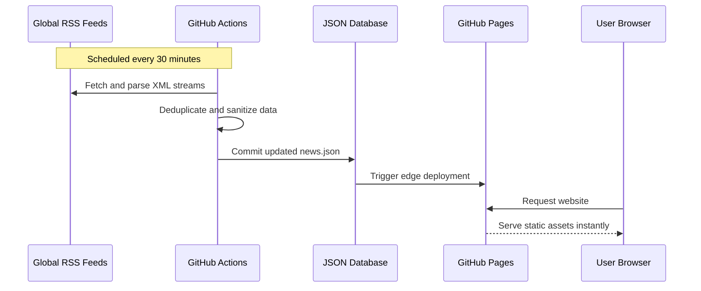

<div align="center">
  <h1>Daily Brief</h1>
  <p>A premium, blazing-fast, serverless news aggregator powered entirely by GitHub Pages.</p>

  [](https://github.com/CodeMasterAbhishek/Daily-Brief/actions/workflows/update-rss.yml)
  [](https://opensource.org/licenses/MIT)
  [](#)

  **[View Live Website](https://CodeMasterAbhishek.github.io/Daily-Brief/)**
</div>

---

## Project Overview

Daily Brief is designed around a modern **GitOps Backend** architecture. Rather than paying for costly backend servers or hitting third-party APIs that can rate-limit your users, this project uses GitHub Actions to run an automated news ingestion engine. 

1. **Automated RSS Pipeline:** Every 30 minutes, a headless script scrapes ~50 of the world's most reputable niche news publishers (BBC, WSJ, MacRumors, IGN, etc.).
2. **Aggressive Deduplication:** The engine runs a strict cross-category global deduplication algorithm, ensuring only 100% unique, high-quality stories make it through.
3. **Static Delivery:** It compiles the data into a single, static JSON database (`data/news.json`). The frontend fetches this file natively.

Because it's completely static and served via GitHub's CDN, the hosting cost is **$0**, the page load is near **instantaneous**, and the architecture is bulletproof against scaling issues.

---

## Features

- **100% Automated Serverless Architecture:** Powered entirely by GitHub Actions and Pages.
- **Premium UI / UX:** Beautiful glassmorphism, dynamic dark/light mode, smooth micro-animations, and full ultrawide monitor support.
- **Strict Deduplication Engine:** Automatically detects and purges identical wire stories across different publishers.
- **Client-Side Read Receipts:** Instantly dims articles you have already clicked on using privacy-first LocalStorage.
- **Automated Pruning:** Keeps the database lean by automatically deleting news older than 7 days, maintaining blazing-fast load times.
- **Infinite Scrolling & Skeletons:** Smoothly loads more news as you scroll, with a perfectly responsive loading skeleton system.
- **PWA Ready:** Implements a Service Worker for intelligent caching and offline resiliency.

---

## Architecture



---

## Folder Structure

```text
/
├── .github/workflows/
│   └── update-rss.yml    # Action for RSS updates (runs every 30 mins)
├── css/
│   ├── variables.css     # Design tokens and themes
│   ├── layout.css        # Grid and responsive layouts
│   └── style.css         # Component styles and animations
├── data/
│   ├── news.json         # Master database consumed by the app
│   └── rss-feeds.json    # List of the 50 trusted RSS publishers
├── js/
│   ├── api.js            # Data fetching logic
│   ├── ui.js             # DOM manipulation and rendering
│   └── app.js            # Main initialization and events
├── scripts/
│   └── fetch-rss.js      # RSS parsing script
├── index.html            # Main entry point
└── package.json          # Node dependencies (rss-parser)
```

---

## Setup & Deployment

Want to run your own version of Daily Brief? 

1. **Fork or Clone the Repository:** Clone this repository to your own GitHub account.
2. **Customize News Sources (Optional):** Edit the `data/rss-feeds.json` file to add or remove RSS feeds. No API keys are required!
3. **Enable GitHub Pages:** 
   - Go to **Settings > Pages** in your repository.
   - Under "Build and deployment", set the Source to **Deploy from a branch**.
   - Select the `main` branch and `/root` folder, and save.
4. **Trigger the First Update:**
   - Go to the **Actions** tab.
   - Select the "Fetch RSS News (Every 30 Mins)" workflow.
   - Click **Run workflow** to generate your first `news.json` database!

---

## Technologies & Resources

If you would like to learn more about the specific technologies powering this architecture, refer to the official documentation below:

- [GitHub Actions](https://docs.github.com/en/actions) - Used for serverless cron automation and backend execution.
- [GitHub Pages](https://pages.github.com/) - Used for high-speed edge caching and global CDN hosting.
- [Node.js](https://nodejs.org/) - Powers the backend ingestion engine.
- [rss-parser](https://www.npmjs.com/package/rss-parser) - Handles robust XML parsing and data extraction.

---

## License

This project is licensed under the MIT License - see the [LICENSE](LICENSE) file for details.
